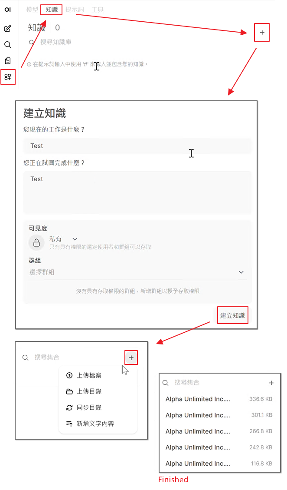

# Openwebui User Manual

### 🚀 Part 1: Setup and Getting Started

Before starting Open-WebUI, you need to already start the LLM model and embedding model through middleware.

1. Please download `open-webui.zip` and `setup_and_run.bat` and place them in the same directory.

2. Double-click `setup_and_run.bat` to launch Open-WebUI.

3. The first time you launch Open-WebUI, it will unzip `open-webui.zip`, install Python, and set up the environment. Then you can use Open-WebUI in your browser.

4. Upload files to Knowledge. We have prepared some sample questions in the open-webui folder. Please wait until the LLM finishes processing.

---

### 🤖 Part 2: Running Inference + RAG

#### Query Methods

1. **Normal Chat:** Directly enter your question in the chat box (will not perform collection retrieval)
2. **Agent Chat:**
   (1) Type <# hashtag symbol> in the chat box and click the collection you create.
   (2) Enter your question after the hashtag

   

#### Verifying Execution Flow

Please confirm the following indicators:

1. **Time To First Token (TTFT) is between 2 ~ 8 seconds**
2. **RAG reference documents are displayed below the response**

   

---
